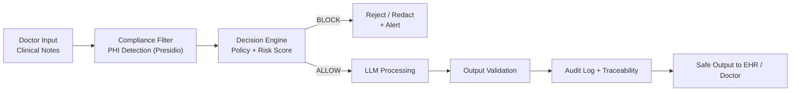

# Healthcare AI Compliance Framework

**Compliance-by-Design for Safe LLM Operations in Healthcare**

Embed HIPAA-compliant guardrails, PHI protection, and complete auditability directly into your architecture.  
No leaks, no fines, no "what if regulators ask?" — only production-ready AI pipelines.

---

## The Problem

In healthcare, **85% of AI projects fail** due to poor architecture and lack of real production use cases.

The result:
- PHI leaks → multi-million dollar fines
- No auditability → loss of regulator trust
- Post-hoc fixes → lost speed and money

You've already built a strong architecture.  
Now the main thing is to **show how it works in a real clinical setting**.

---

## The Solution

A lightweight, production-ready **compliance engine** that becomes a guardrail layer in front of any LLM or AI agent.

### Main Use Case: Safe LLM for Clinical Notes

Doctor dictates notes → framework automatically filters PHI → LLM processes only safe text → output validation → complete audit.

**Pipeline:**


## API Response Example (BLOCK):

```json
{
  "input": "Patient SSN is 123-45-6789",
  "decision": "BLOCK",
  "violations": ["SSN detected"],
  "risk_score": 0.94,
  "action": "redact or reject"
}
```
## Who Uses This
AI Engineers in healthtech startups

Compliance and Risk teams in hospitals

EHR system and clinical LLM agent developers

## Where It's Used
In production pipelines: clinical note processing, patient-facing chatbots, diagnostic assistants, medical record summarization — anywhere PHI meets AI.

## Architecture
 *System Architecture — overall framework structure* *Decision Flow — real-time decision making process* *Data Flow — secure data movement*
(All diagrams are already in the /diagrams/ folder and will be displayed automatically)

## Demo (Game Changer — Run in 60 Seconds)

### 1. Quick Start
```bash
git clone https://github.com/BehaBB/healthcare-ai-compliance-framework.git
cd healthcare-ai-compliance-framework
python -m venv venv && source venv/bin/activate
pip install -r requirements.txt
uvicorn tooling.api:app --reload
```
http://127.0.0.1:8000/docs
