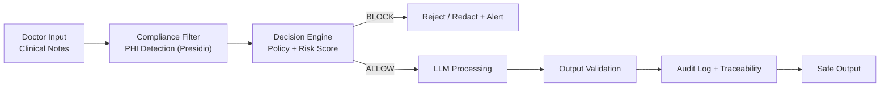

# Healthcare AI Compliance Framework

**Compliance-by-Design for Safe LLM Operations in Healthcare**

Embed HIPAA-aligned guardrails, PHI protection, and full auditability directly into your AI pipelines.
No leaks. No fines. No uncertainty during audits.

---

## ❗ The Problem

In healthcare, **up to 85% of AI projects fail** due to poor architecture and lack of production readiness.

Common issues:

* PHI leaks → regulatory fines
* No auditability → loss of trust
* Compliance added too late → costly rework

AI is not the problem.
**Architecture and compliance are.**

---

## ✅ The Solution

A lightweight, production-ready **AI compliance engine** that acts as a guardrail layer between users and LLMs.

### 🧩 Main Use Case: Safe LLM for Clinical Notes

Doctor input → PHI detection → decision engine → safe LLM processing → output validation → audit logging

---

## 🏗 Pipeline



---

## ⚡ Example (Real Output)

```json
{
  "input": "Patient SSN is 123-45-6789",
  "decision": "BLOCK",
  "violations": ["SSN detected"],
  "risk_score": 0.94,
  "action": "redact or reject"
}
```

---

## 👥 Who Uses This

* AI Engineers in healthtech startups
* Compliance & Risk teams
* EHR and clinical AI developers

---

## 🏥 Where It's Used

* Clinical note processing
* Patient-facing chatbots
* Diagnostic assistants
* Medical record summarization

Anywhere **PHI meets AI**

---

## 🧠 Architecture


*High-level system design*


*Real-time decision logic*


*Secure data movement*

---

## 🚀 Quick Start (Run in ~60 seconds)

```bash
git clone https://github.com/BehaBB/healthcare-ai-compliance-framework.git
cd healthcare-ai-compliance-framework

python -m venv venv
source venv/bin/activate    # Windows: venv\Scripts\activate

pip install -r requirements.txt
python -m spacy download en_core_web_lg

uvicorn tooling.api:app --reload
```

Open API docs:
http://127.0.0.1:8000/docs

---

## 🔬 Test Cases

### ✅ Safe Input

```bash
curl -X POST http://127.0.0.1:8000/process \
  -H "Content-Type: application/json" \
  -d '{"input_text": "Patient reports mild headache and fatigue."}'
```

---

### ❌ PHI (Should BLOCK)

```bash
curl -X POST http://127.0.0.1:8000/process \
  -H "Content-Type: application/json" \
  -d '{"input_text": "Patient SSN is 123-45-6789"}'
```

---

### ⚠️ Borderline Case

```bash
curl -X POST http://127.0.0.1:8000/process \
  -H "Content-Type: application/json" \
  -d '{"input_text": "Contact Dr. Smith at 555-0123"}'
```

**Expected response:**

```json
{
  "decision": "ALLOW_WITH_REDACTION",
  "violations": ["potential phone number"],
  "risk_score": 0.65,
  "action": "redact before LLM"
}
```

---

## 🌍 Why It Matters

This is not just a compliance checklist.

It enables:

* **Engineers** → safely deploy LLMs
* **Compliance teams** → get full audit trails
* **Organizations** → ship faster without regulatory risk

---

## ⚙️ Key Features

* Compliance-by-design architecture
* PHI detection & redaction (Microsoft Presidio)
* Policy-based decision engine
* Risk scoring + explainability
* Full audit logging
* FastAPI + OpenAPI integration

---

## ⚠️ Disclaimer

This project is a reference framework and prototype.
It is not a medical device and does not replace legal or regulatory compliance review.
