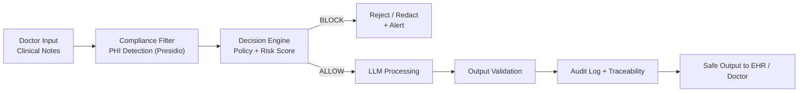
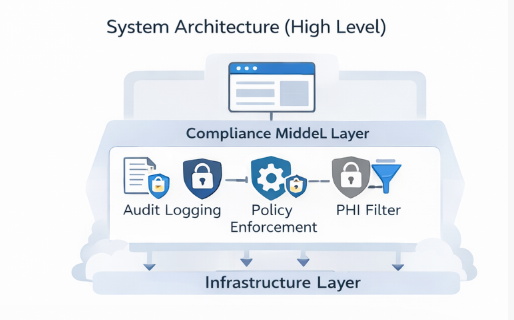
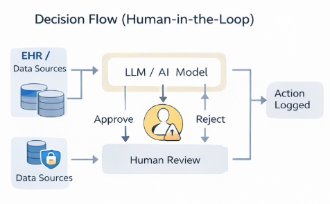
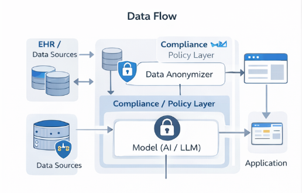

# Healthcare AI Compliance Framework

**Compliance-by-Design for Safe LLM Operations in Healthcare**

Embed HIPAA-compliant guardrails, PHI protection, and complete auditability directly into your architecture.  
No leaks, no fines, no "what if regulators ask?" — only production-ready AI pipelines.

---

## The Problem

In healthcare, **85% of AI projects fail** due to poor architecture and lack of real production use cases.

The result:
- PHI leaks → multi-million dollar fines
- No auditability → loss of regulator trust
- Post-hoc fixes → lost speed and money

You've already built a strong architecture.  
Now the main thing is to **show how it works in a real clinical setting**.

---

## The Solution

A lightweight, production-ready **compliance engine** that becomes a guardrail layer in front of any LLM or AI agent.

### Main Use Case: Safe LLM for Clinical Notes

Doctor dictates notes → framework automatically filters PHI → LLM processes only safe text → output validation → complete audit.

**Pipeline:**


## API Response Example (BLOCK):

```json
{
  "input": "Patient SSN is 123-45-6789",
  "decision": "BLOCK",
  "violations": ["SSN detected"],
  "risk_score": 0.94,
  "action": "redact or reject"
}
```
## Who Uses This
AI Engineers in healthtech startups

Compliance and Risk teams in hospitals

EHR system and clinical LLM agent developers

## Where It's Used
In production pipelines: clinical note processing, patient-facing chatbots, diagnostic assistants, medical record summarization — anywhere PHI meets AI.

## Architecture
 *System Architecture — overall framework structure* *Decision Flow — real-time decision making process* *Data Flow — secure data movement*
(All diagrams are already in the /diagrams/ folder and will be displayed automatically)

## Demo (Game Changer — Run in 60 Seconds)

## Getting Started

Follow these steps to set up and run the Healthcare AI Compliance Framework locally in under 2 minutes.

### Prerequisites

- Python 3.10 or higher
- Git
- (Optional) Docker (for containerized deployment)

### 1. Clone the Repository

```bash
git clone https://github.com/BehaBB/healthcare-ai-compliance-framework.git
cd healthcare-ai-compliance-framework
```
### 2. Create Virtual Environment & Install Dependencies
```bash
# Create and activate virtual environment
python -m venv venv
source venv/bin/activate    # On Windows: venv\Scripts\activate
# Install requirements
pip install -r requirements.txt
```
**Note:** The framework uses Microsoft Presidio for PHI detection. Make sure the SpaCy model is downloaded:
```bash
python -m spacy download en_core_web_lg
```
### 3. Run the API Server
```bash
uvicorn app.main:app --reload --host 0.0.0.0 --port 8000
```
### Prerequisites

- Python 3.10 or higher
- Git
- (Optional) Docker (for containerized deployment)

### 1. Clone the Repository

```bash
git clone https://github.com/BehaBB/healthcare-ai-compliance-framework.git
cd healthcare-ai-compliance-framework
```

### 2. Create Virtual Environment & Install Dependencies
```Bash
# Create and activate virtual environment
python -m venv venv
source venv/bin/activate    # On Windows: venv\Scripts\activate
```
# Install requirements
pip install -r requirements.txt
Note: The framework uses Microsoft Presidio for PHI detection. Make sure the SpaCy model is downloaded:
Bashpython -m spacy download en_core_web_lg

### 3. Run the API Server
```Bash
uvicorn app.main:app --reload --host 0.0.0.0 --port 8000
```
The server will start at: http://127.0.0.1:8000
### 4. Open Interactive Docs

Go to:

● Swagger UI → http://127.0.0.1:8000/docs

● ReDoc → http://127.0.0.1:8000/redoc

### 5. Quick Health Check
```Bash
Bashcurl -X GET "http://127.0.0.1:8000/health"
```
**Expected response:**
```JSON
{
  "status": "healthy",
  "version": "0.1.0",
  "compliance_engine": "ready"
}
```
### 6. Test with Real Examples
See the Demo section above for three ready-to-run curl commands:

● Safe clinical note

● PHI leakage (should BLOCK)

● Borderline case (should REVIEW / redact)

### 1. Quick Start
```bash
git clone https://github.com/BehaBB/healthcare-ai-compliance-framework.git
cd healthcare-ai-compliance-framework
python -m venv venv && source venv/bin/activate
pip install -r requirements.txt
uvicorn tooling.api:app --reload
```
http://127.0.0.1:8000/docs

## Three Real Cases

### ✅ Safe Text
```bash
curl -X POST http://127.0.0.1:8000/process \
  -H "Content-Type: application/json" \
  -d '{"input_text": "Patient reports mild headache and fatigue after vaccination."}'
```
### ❌ PHI (Critical)
```bash
curl -X POST http://127.0.0.1:8000/process \
  -H "Content-Type: application/json" \
  -d '{"input_text": "Patient SSN is 123-45-6789"}'
```
###  ⚠️ Borderline Case
```bash
curl -X POST http://127.0.0.1:8000/process \
  -H "Content-Type: application/json" \
  -d '{"input_text": "The patient is a 45-year-old male with hypertension. Contact Dr. Smith at 555-0123 for follow-up."}'
```
### Expected response:
```json
{
  "input": "The patient is a 45-year-old male...",
  "decision": "ALLOW_WITH_REDACTION",
  "violations": ["potential phone number"],
  "risk_score": 0.65,
  "action": "redact PII before LLM"
}
```
### Why It Matters
This isn’t just "another compliance checklist."
It is a production-ready layer that enables:

● Engineers — to instantly integrate LLMs without risk

● Compliance teams — to generate automated audit trails

● Hospitals and startups — to bring AI to market faster and pass audits

### The Result:
You no longer fear regulators.
You stay ahead of the competition.

### Key Features
● Compliance-by-design architecture

● HIPAA-aligned controls

● PHI detection & redaction (Microsoft Presidio)

● Real-time decision engine + risk scoring

● Full audit logging (thread-safe)

● Secure LLM pipeline examples
● FastAPI + OpenAPI docs

### Disclaimer
This is a reference framework and prototype.
It is not a medical device and does not replace legal or regulatory assessment.
