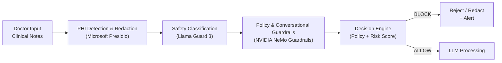

# Healthcare AI Guardrails Framework

**Production-ready compliance layer for safe and compliant LLM deployment in healthcare**

Embed HIPAA-aligned guardrails, PHI protection, risk-based decisioning, and immutable audit trails directly into your AI pipelines.

**No PHI leaks. No regulatory fines. Full auditability from day one.**

---

## ❗ The Problem

Healthcare AI projects continue to fail at high rates — not because of model performance, but due to missing **compliance-by-design** architecture and inadequate guardrails.

Common failure points:
- Uncontrolled PHI exposure leading to regulatory fines
- Lack of audit trails for compliance reviews
- Unsafe or inaccurate medical recommendations
- Vulnerability to prompt injection and jailbreak attacks
- Compliance added as an afterthought → expensive rework

**Powerful AI in healthcare without strong guardrails becomes a serious liability.**

---

## ✅ The Solution

**Healthcare AI Guardrails Framework** is a lightweight, modular, policy-driven compliance engine that acts as a secure middleware layer between users and any LLM.

It combines best-in-class tools available in 2026:
- **Microsoft Presidio** — for accurate PHI detection and redaction
- **Llama Guard 3** (Meta) — for input/output safety classification based on MLCommons hazards taxonomy
- **NVIDIA NeMo Guardrails** — for advanced conversational control, topic guidance, jailbreak prevention, and domain-specific medical policies

### Main Use Case: Safe LLM for Clinical Notes

Doctor input → PHI detection & redaction → multi-layer safety & compliance checks → LLM processing (only on safe text) → output validation → structured audit log.

**Enhanced Compliance Pipeline:**


   **Example Response (BLOCK case)**
```JSON
{
  "input": "Patient SSN is 123-45-6789",
  "decision": "BLOCK",
  "violations": ["SSN detected", "unsafe_content"],
  "risk_score": 0.94,
  "guardrails_triggered": ["presidio_phi", "llama_guard3"],
  "action": "redact or reject"
}
```
### 👥 Who Uses This

● Healthtech AI Engineers building clinical applications

● Compliance & Risk teams in hospitals and payers

● Developers of EHR-integrated AI assistants

● Teams creating diagnostic support or medical summarization tools

### 🏥 Where It Is Used
Clinical documentation assistants, patient chatbots, medical record summarization, diagnostic decision support — anywhere protected health information (PHI) meets generative AI.

### 🧠 Key Features

PHI Protection: Microsoft Presidio Analyzer + Anonymizer with healthcare-specific recognizers

Safety Guardrails: Llama Guard 3 for harm detection (MLCommons taxonomy)

Conversational Control: NVIDIA NeMo Guardrails for medical policies, topic control, and jailbreak resistance

Risk-based Decisioning: Configurable risk scoring and policy engine

Immutable Auditing: Structured logging with trace_id and OpenTelemetry support

Modular Architecture: Easy to extend with custom policies and additional guardrails

FastAPI + OpenAPI: Interactive documentation and easy integration


### 🚀 Getting Started
**Prerequisites**

● Python 3.10 or higher

● Git

**Installation & Run**
```bash
Bashgit clone https://github.com/BehaBB/healthcare-ai-compliance-framework.git
cd healthcare-ai-compliance-framework

python -m venv venv
source venv/bin/activate          # On Windows: venv\Scripts\activate

pip install -r requirements.txt

# Download required models
python -m spacy download en_core_web_lg

uvicorn tooling.api:app --reload --host 0.0.0.0 --port 8000
```
Open interactive API documentation:
http://127.0.0.1:8000/docs

### Quick Health Check
Bashcurl -X GET "http://127.0.0.1:8000/health"

### 🔬 Demo: Test Three Cases
**1. Safe Text**
```bash
curl -X POST http://127.0.0.1:8000/process \
  -H "Content-Type: application/json" \
  -d '{"input_text": "Patient reports mild headache and fatigue after vaccination."}'
```
**2. PHI (Should BLOCK)**
```bash
curl -X POST http://127.0.0.1:8000/process \
  -H "Content-Type: application/json" \
  -d '{"input_text": "Patient SSN is 123-45-6789"}'
```
**3. Borderline / Potential Unsafe Case**
```bash
curl -X POST http://127.0.0.1:8000/process \
  -H "Content-Type: application/json" \
  -d '{"input_text": "The patient is a 45-year-old male with hypertension. Contact Dr. Smith at 555-0123 for follow-up."}'
```
### 📋 Compliance Mapping (HIPAA-aligned)

| HIPAA Security Rule          | Implementation                                           | Status |
|--------------------         -|----------------                                          |--------|
| **Access Control**           | PHI redaction + policy enforcement (RBAC-ready)          | ✅ |
| **Audit Controls**           | Immutable logs with trace_id + OpenTelemetry integration | ✅ |
| **Integrity**                | Multi-layer input/output validation + decision trace     | ✅ |
| **PHI De-identification**    | Microsoft Presidio Analyzer & Anonymizer                 | ✅ |
| **Transmission Security**    | Redaction before LLM + secure audit export               | 🚧 In Progress |

### ⚠️ Disclaimer
This is a reference framework and prototype for research and development purposes.

It is not a certified medical device or substitute for professional regulatory, legal, or clinical validation.

Always perform your own compliance assessment before production use.

License: MIT
    
