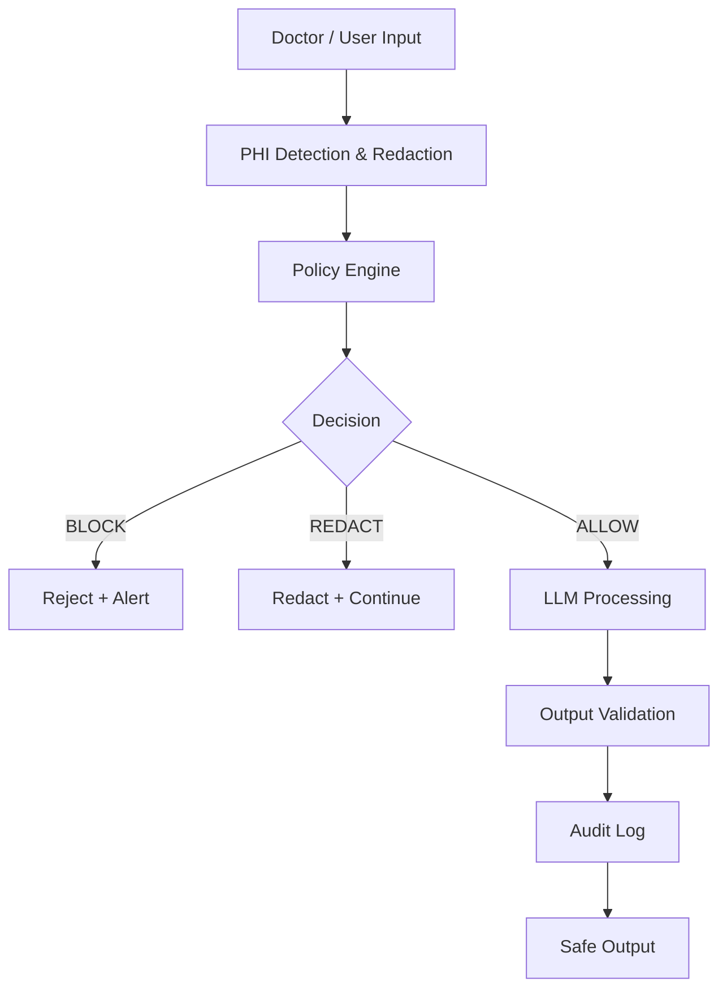

# Healthcare AI Guardrails Framework

**Production-ready compliance layer for safe LLM deployment in regulated healthcare**

Embed HIPAA-aligned guardrails, PHI protection, risk-based decisioning, and immutable audit trails directly into your AI pipelines.

**No PHI leaks. No regulatory fines. Full auditability from day one.**

---

## ❗ The Problem

Healthcare AI projects fail at alarming rates — not because of the models, but due to missing **compliance-by-design** architecture.

Common failure points:
- Uncontrolled PHI exposure → regulatory fines  
- Lack of audit trails during reviews  
- Compliance added too late → expensive rework  
- Unsafe medical recommendations  
- No protection against prompt injection / jailbreaks  

**AI is powerful. Without guardrails, it becomes a liability.**

---

## ✅ The Solution

**Healthcare AI Guardrails Framework** — a lightweight, policy-driven compliance engine that sits between users and LLMs.

It provides:
- Real-time PHI detection & redaction (Microsoft Presidio)  
- Configurable policy engine (YAML + hot reload)  
- Risk scoring aligned with HIPAA/FDA expectations  
- Multi-layer safety guardrails  
- Immutable audit logging with traceability  

---

## 🏗 Compliance Pipeline


## ⚡ Real Example
**❌ Unsafe Input**
```json
{
  "input_text": "Patient Natalia Smith, born 15.05.1985, SSN 123-45-6789. Recommend metformin dosage."
}
```
**Response**
```json
{
  "decision": "BLOCK",
  "risk_score": 0.92,
  "violations": ["PHI detected", "medical advice risk"],
  "action_taken": "rejected",
  "requires_human_review": true
}
```
## ✅ Safe Input
```json
{
  "input_text": "Patient reports mild headache and fatigue."
}
```
Response → **processed safely with LLM**

## 👥 Who Uses This
Healthtech AI engineers
Compliance & Risk teams
EHR / clinical system developers
## 🏥 Use Cases
Clinical documentation assistants
Patient chatbots
Medical summarization pipelines
Decision support systems
## 🧠 Key Features
Compliance-by-design architecture
PHI detection & redaction
Policy-based decision engine
Risk scoring + explainability
Medical safety controls
Full audit logging (trace_id, policy hash)
FastAPI + OpenAPI integration
## 🚀 Quick Start
```bash
git clone https://github.com/BehaBB/healthcare-ai-compliance-framework.git
cd healthcare-ai-compliance-framework

python -m venv venv
source venv/bin/activate

pip install -r requirements.txt
python -m spacy download en_core_web_lg

uvicorn tooling.api:app --reload
```
Open docs:
http://127.0.0.1:8000/docs

## 🔬 Test API
**Safe**
```bash
curl -X POST http://127.0.0.1:8000/process \
  -H "Content-Type: application/json" \
  -d '{"input_text": "Patient reports mild headache."}'
```
**Should BLOCK**
```bash
curl -X POST http://127.0.0.1:8000/process \
  -H "Content-Type: application/json" \
  -d '{"input_text": "Patient SSN is 123-45-6789"}'
```
## 📋 Compliance Mapping
Requirement	      Implementation	    Status

PHI Protection	   Presidio detection	✅

Audit Logging	   trace_id + logs  	✅

Risk Scoring	    decision engine 	✅

Human Review	    policy rules	    ✅
## ⚠️ Disclaimer

This is a reference framework and prototype.
Not a certified medical device.
Always perform regulatory and clinical validation before production use.

## 🛣 Roadmap
Human-in-the-loop workflows
Observability (OpenTelemetry)
EU AI Act support
Adversarial testing
Bias monitoring
